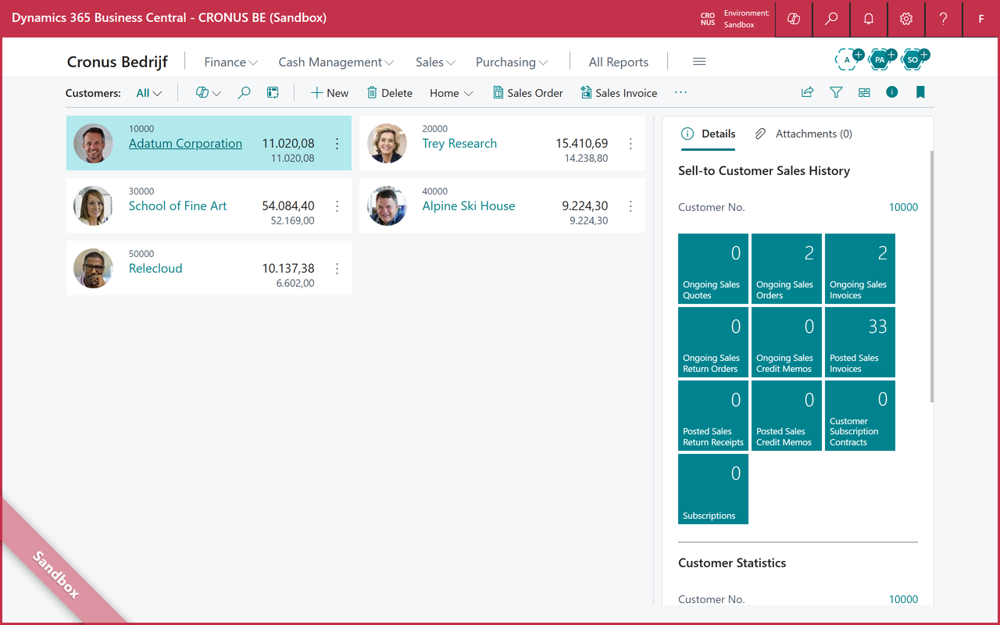
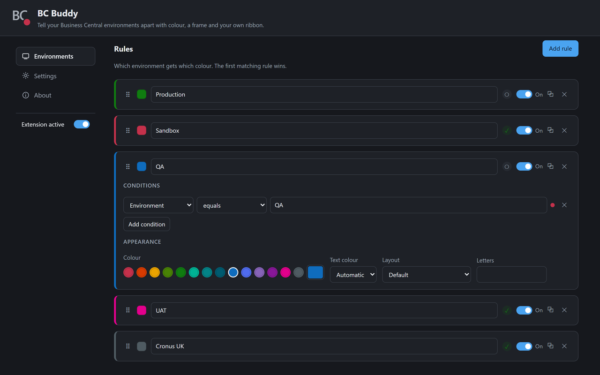
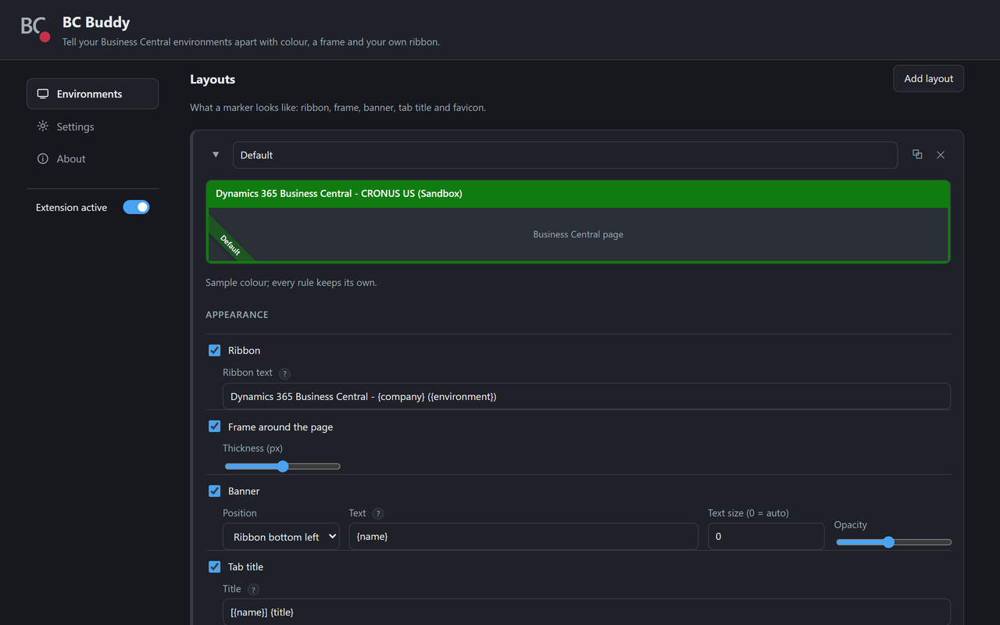

# BC Buddy

> **Tell your Business Central environments apart** 🎨

If you work across several customers or environments, all your Business Central
tabs start to look the same. Posting in production while you thought you were in
a sandbox is easily done.

BC Buddy gives every environment its own colour. The most visible part is the
bar at the top of the BC client, which takes your colour and your own text:

```
Dynamics 365 Business Central - CRONUS BE (Sandbox)
```

Alongside that it can draw a coloured frame around the window, a banner, a
marked tab title and a coloured tab icon.



A Chrome/Edge extension (Manifest V3). The full documentation is on the website:
**<https://fvet.github.io/bcbuddy/>**. Working on the extension itself is
covered in [DEVELOPMENT.md](DEVELOPMENT.md).

## 📥 Installing

1. Open `chrome://extensions` (or `edge://extensions`).
2. Turn on **Developer mode**.
3. Click **Load unpacked** and pick the folder of this repository.
4. The options page opens automatically on first install.

## 🚀 Getting started

The options page opens on **Environments**. To mark your first environment:

1. Click **Add rule**.
2. Give it a name — that name is what `{name}` produces in your texts, so
   something like `PRODUCTION` or the customer's name works well.
3. Set a condition. The simplest is *environment* *equals* `Production`. If you
   are unsure what to match on, paste a real BC URL into the **Test URL** field
   at the top; the page shows you which environment, company and tenant it read
   out of it, and previews the result live.
4. Pick a colour. Red for production is the obvious start.
5. Add a second rule for your sandbox in a different colour.



Order decides priority: the first rule that fits is applied, so put your most
specific rules at the top.

## 🎯 How matching works

A rule consists of one or more **conditions**; all of them must hold. A URL is
broken down into fields you can match on:

| Field | From this example URL |
|---|---|
| `url` | the full, decoded URL |
| `environment` | `Sandbox` |
| `company` | `CRONUS BE` |
| `tenant` | `453d817a-d5b1-49c1-bdcf-d9474180a702` |

```
https://businesscentral.dynamics.com/453d817a-d5b1-49c1-bdcf-d9474180a702/Sandbox?company=CRONUS%20BE&page=1
```

So you can match on a value that simply occurs *somewhere in the URL* (`url` +
`contains`), or more precisely on environment or company. Operators: contains,
equals, starts with, ends with, RegEx, does not contain.

Both Business Central online and on-premises are recognised. On-prem the server
instance sits where the environment would be (`/BC240/?company=...`) and the
tenant comes from the query.

Rules apply on every site, not only on `businesscentral.dynamics.com`. That is
not a luxury: an on-prem installation runs on your own host, so the URL alone
does not reveal that it is Business Central. If you want only BC marked, put
that in the conditions of your rule (for example `url` `contains`
`businesscentral.dynamics.com`).

## 🗂️ Rules and layouts

The options page has a navigation on the left: **Environments** (layouts and
rules), **Settings** (shared configuration, import/export) and **About**.

The difference between the two lists:

- A **rule** says *which* environment you recognise and *which colour* it gets:
  name, conditions, colour, text colour and the letters on the tab icon.
- A **layout** says *how* a marking looks: ribbon, frame, banner, tab title and
  whether there is a tab icon. Several rules can use the same layout, so you
  maintain those settings in one place.

There is always at least one layout; new rules get *Default*. Delete a layout
and the rules that hung on it fall back to the first one in the list.

## ✨ What a layout can show

- **Ribbon** — the bar at the top of the BC client takes the colour of the rule
  and a text of your own.
- **Frame** — coloured border around the whole window (width 1 to 5 px, 3 by
  default).
- **Banner** — a bar along the bottom or a diagonal ribbon in one of the four
  corners.
- **Tab title** — e.g. `[TEST] Company Information`.
- **Favicon** — coloured tab icon with the first letters, so you spot the right
  tab straight away in a row of tabs.



The preview at the top of a layout updates as you change it, so you can see what
a marking will look like before you meet it in the client.

Text colour is *automatic* by default: white or black, depending on what is
readable on the chosen colour.

### 🔤 Tokens

You can use tokens in every text:

`{name}` `{environment}` (or `{env}`) `{company}` `{title}` (the original tab
title)

Empty tokens are cleaned up: if there is no company in the URL, no stray dashes
or empty brackets are left behind.

## 👥 Sharing settings with your team

Everyone in the team can work from the same markings, so a colleague opening a
customer's production environment sees the same red you do.

1. Set up your layouts and rules and click **Export**; that produces
   `bc-buddy.json`, layouts included.
2. Put that file somewhere everyone can reach it over HTTPS — a repository, for
   instance. Only use a URL you control: the file can define rules that mark
   any site.
3. Everyone fills in the URL on the options page under **Shared configuration**:
   `https://raw.githubusercontent.com/fvet/bcbuddy/main/examples/bc-buddy.json`
   An ordinary `github.com/.../blob/...` link is fine too; it is converted to
   the raw variant automatically. Plain HTTP is refused.
4. A click on **Synchronise** fetches the file and thereby switches the shared
   configuration on right away: from then on it is updated every day. There is
   no separate toggle — synchronising is the toggle.
5. The `X` next to *Shared rules* clears what came in and switches them off
   again, otherwise they are simply back the next day. The URL stays, so one
   click on synchronise is enough to start over.

Shared rules sit at the bottom of the list and cannot be edited. To adjust one,
use the copy button on that rule: you get your own version, with its layout
alongside, and that takes precedence over the shared one. An example file is in
[`examples/bc-buddy.json`](examples/bc-buddy.json).

Importing goes through **Import / export > Choose file** and works as a merge: a
rule you already have is overwritten in place, new rules are added, and rules
that are not in the file are left alone.

## 🌍 Languages

The extension is available in Dutch and English. It follows the language of your
browser: if that is set to Dutch you see the Dutch texts, otherwise the
English ones. There is no switch and no setting.

What is *not* translated: the texts you fill in yourself in a rule. Whatever you
put in the ribbon, the banner or the tab title appears exactly as you type it.

## 🔒 Privacy

Everything stays on your own machine. No server, no analytics, no tracking. The
only network request BC Buddy makes is fetching the shared configuration file
from the URL you configure yourself; leave that empty and no traffic leaves your
machine at all. Full text in [PRIVACY.md](PRIVACY.md).

## 🛟 Troubleshooting

**The ribbon keeps its original colour.** The ribbon is found by its text
("Dynamics 365 Business Central"), so a BC client that renders it differently
can escape detection. The frame, banner, tab title and tab icon are unaffected
and still mark the environment.

**Nothing is marked at all.** Check the rule's conditions against a real URL
using the **Test URL** field on the options page — it shows what it managed to
read. A rule whose conditions never all hold at once never fires.

**A shared rule will not change.** Shared rules are read-only by design. Use the
copy button to get your own editable version, which takes precedence.
